House price project
================
Adrien Riaux
01/08/2022

# Introduction

This house price project revolves around the real estate domain, aiming
to predict property prices. The dataset includes various columns such as
features related to houses.

Using machine learning techniques, this project strives to provide
accurate predictions of house prices, empowering real estate
professionals with valuable insights for making informed decisions in
the housing market.

``` r
# Import
library(dplyr)
```

    ## Warning: package 'dplyr' was built under R version 4.1.3

    ## 
    ## Attaching package: 'dplyr'

    ## The following objects are masked from 'package:stats':
    ## 
    ##     filter, lag

    ## The following objects are masked from 'package:base':
    ## 
    ##     intersect, setdiff, setequal, union

``` r
library(tidyr)
```

    ## Warning: package 'tidyr' was built under R version 4.1.3

``` r
library(ggfortify)
```

    ## Warning: package 'ggfortify' was built under R version 4.1.3

    ## Loading required package: ggplot2

    ## Warning: package 'ggplot2' was built under R version 4.1.3

``` r
library(ggplot2)
library(coefplot)
```

    ## Warning: package 'coefplot' was built under R version 4.1.3

    ## Registered S3 methods overwritten by 'useful':
    ##   method         from     
    ##   autoplot.acf   ggfortify
    ##   fortify.acf    ggfortify
    ##   fortify.kmeans ggfortify
    ##   fortify.ts     ggfortify

## Exploratory Data Analysis

``` r
# Read the data
df <- read.csv("house_price.csv", header=TRUE, sep=",")
head(df)
```

    ##   Units   SqFt   Income Expense ValuePerSqFt      Boro
    ## 1    42  36500  1332615  342005       200.00 Manhattan
    ## 2    78 126420  6633257 1762295       242.76 Manhattan
    ## 3   500 554174 17310000 3543000       164.15 Manhattan
    ## 4   282 249076 11776313 2784670       271.23 Manhattan
    ## 5   239 219495 10004582 2783197       247.48 Manhattan
    ## 6   133 139719  5127687 1497788       191.37 Manhattan

We can observe that our dataframe several informations. For these data
the response is the value per square foot and the predictors are
everything else.

Moreover, it seems that the Boro column is categorical features. To
verify that, we observe the number of unique value for these features.

``` r
# Check unique value of categorical features
print(unique(df[, "Boro"]))
```

    ## [1] "Manhattan"     "Brooklyn"      "Queens"        "Bronx"        
    ## [5] "Staten Island"

Well, we have only five possible values for Boro column. Use Boro as
factor would be interesting.

So we can now convert Boro feature into an appropriate type.

``` r
# Convert type
df[, "Boro"] <- as.factor(df[, "Boro"])
sapply(df, class)
```

    ##        Units         SqFt       Income      Expense ValuePerSqFt         Boro 
    ##    "integer"    "integer"    "integer"    "integer"    "numeric"     "factor"

``` r
# Data description
summary(df)
```

    ##      Units              SqFt             Income            Expense        
    ##  Min.   :   1.00   Min.   :    478   Min.   :    6424   Min.   :    1740  
    ##  1st Qu.:  15.00   1st Qu.:  18704   1st Qu.:  405180   1st Qu.:  155515  
    ##  Median :  30.00   Median :  38456   Median :  943901   Median :  350264  
    ##  Mean   :  70.18   Mean   :  82763   Mean   : 2640882   Mean   :  840916  
    ##  3rd Qu.:  75.00   3rd Qu.:  90626   3rd Qu.: 2725550   3rd Qu.:  899084  
    ##  Max.   :3378.00   Max.   :3364977   Max.   :56010967   Max.   :21771401  
    ##   ValuePerSqFt               Boro     
    ##  Min.   : 10.66   Bronx        :  69  
    ##  1st Qu.: 74.63   Brooklyn     : 717  
    ##  Median :112.22   Manhattan    :1380  
    ##  Mean   :131.19   Queens       : 434  
    ##  3rd Qu.:187.49   Staten Island:  26  
    ##  Max.   :399.38

We have no null values in the dataframe. Regarding Units, Income,
Expense and Value features we have outliers. It is important to identify
them. We will deal with it later.

We can use graphical analysis to have more insight on the data.

``` r
# Plot histogram of value per square foot
ggplot(data=df, aes(x=ValuePerSqFt)) +
  geom_histogram(alpha=0.7)
```

    ## `stat_bin()` using `bins = 30`. Pick better value with `binwidth`.

<!-- -->

We can see that the histogram has a bimodal nature. So we explore more
using histogram with a mapping color to Boro feature.

``` r
# Histogram using a mapping color to Boro
ggplot(data=df, aes(x=ValuePerSqFt, fill=Boro)) +
  geom_histogram(alpha=0.7)
```

    ## `stat_bin()` using `bins = 30`. Pick better value with `binwidth`.

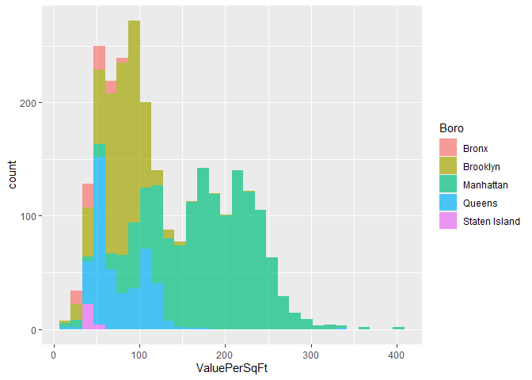<!-- -->

``` r
# Same histogram using facet wrap
ggplot(data=df, aes(x=ValuePerSqFt, fill=Boro)) +
  geom_histogram(alpha=0.7) +
  facet_wrap(~Boro)
```

    ## `stat_bin()` using `bins = 30`. Pick better value with `binwidth`.

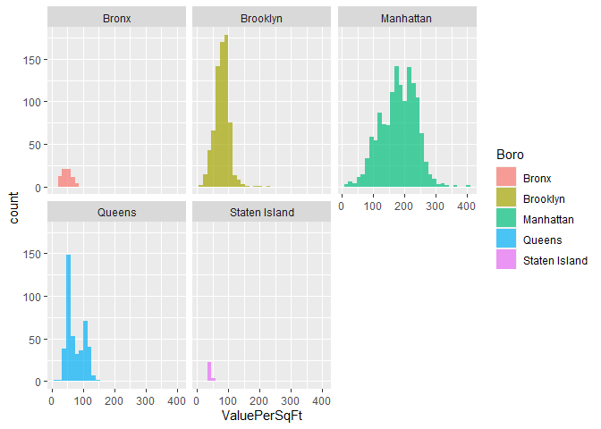<!-- -->

We can see that Brooklyn and Queens make up one mode and Manhattan make
up the other. While there is not much data on the Bronx and Staten
Island.

Boxplot can also be helpful to analyse the response.

``` r
# ValuePerSqFt boxplot
ggplot(data=df, aes(x=Boro, y=ValuePerSqFt)) +
  geom_boxplot(aes(color=Boro))
```

<!-- -->

It seems that despite the unbalanced between groups, the ValuePerSqFt
depends of the Boro, Manhattan median is higher than the others for
example.

Now we look at histograms for SqFt, Units, Expense, Income and Value.

``` r
ggplot(data=df, aes(x=Units)) +
  geom_histogram(alpha=0.7)
```

    ## `stat_bin()` using `bins = 30`. Pick better value with `binwidth`.

<!-- -->

It seems we have some outliers above 1000 units.

``` r
# Check the number of house with more than 1000 units
sum(df$Units >= 1000)
```

    ## [1] 6

We have only 6 outliers. We simply drop them.

``` r
# Remove outlier based on Units feature
df <- df[df$Units < 1000, ]
```

Now we can analyse over features and check if there are outliers
remaining.

``` r
for (col in c(1:4)) {
  col_name <- names(df)
  g <- ggplot(data=df, aes(x=df[, col])) +
    geom_histogram(alpha=0.7) +
    xlab(col_name[col])
  print(g)
}
```

    ## `stat_bin()` using `bins = 30`. Pick better value with `binwidth`.

<!-- -->

    ## `stat_bin()` using `bins = 30`. Pick better value with `binwidth`.

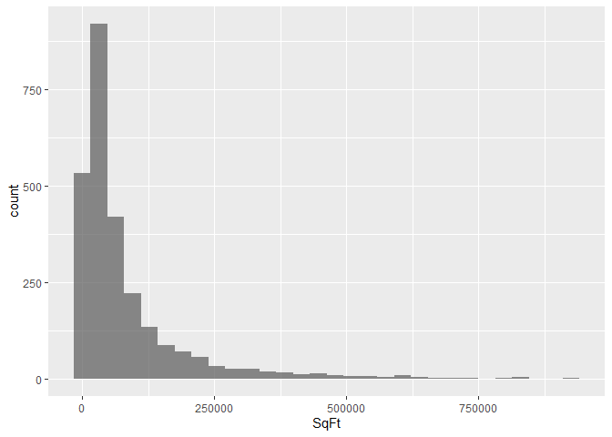<!-- -->

    ## `stat_bin()` using `bins = 30`. Pick better value with `binwidth`.

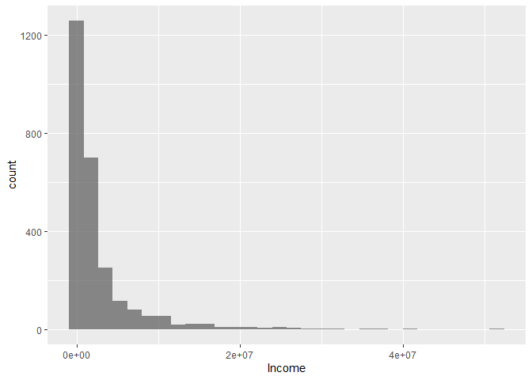<!-- -->

    ## `stat_bin()` using `bins = 30`. Pick better value with `binwidth`.

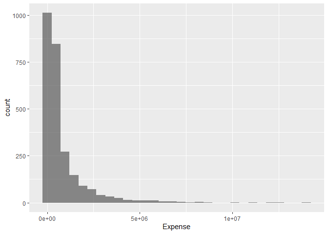<!-- -->

They all have a log normal distribution, then it can be difficult for
our machine learning model to use these values. Using log give a normal
distribution. So we create new columns.

``` r
# Create log columns
df$logUnits <- log(df$Units)
df$logExpense <- log(df$Expense)
df$logIncome <- log(df$Income)
df$logSqFt <- log(df$SqFt)

head(df)
```

    ##   Units   SqFt   Income Expense ValuePerSqFt      Boro logUnits logExpense
    ## 1    42  36500  1332615  342005       200.00 Manhattan 3.737670   12.74258
    ## 2    78 126420  6633257 1762295       242.76 Manhattan 4.356709   14.38213
    ## 3   500 554174 17310000 3543000       164.15 Manhattan 6.214608   15.08048
    ## 4   282 249076 11776313 2784670       271.23 Manhattan 5.641907   14.83964
    ## 5   239 219495 10004582 2783197       247.48 Manhattan 5.476464   14.83911
    ## 6   133 139719  5127687 1497788       191.37 Manhattan 4.890349   14.21950
    ##   logIncome  logSqFt
    ## 1  14.10265 10.50507
    ## 2  15.70761 11.74736
    ## 3  16.66679 13.22523
    ## 4  16.28160 12.42551
    ## 5  16.11855 12.29908
    ## 6  15.45017 11.84739

To see how it helps, we can visualize ValuePerSqFt versus log features.

``` r
#Plot density of postcode per propertyType
for (col in c(7:10)) {
  col_name <- names(df)
  g <- ggplot(data=df, aes(x=df[, col], y=ValuePerSqFt)) +
    geom_point(alpha=0.7, aes(color=Boro)) +
    xlab(col_name[col])
  print(g)
}
```

<!-- -->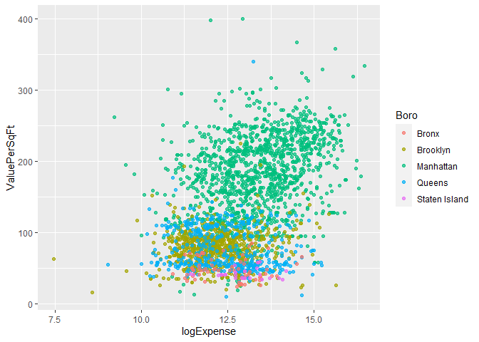<!-- -->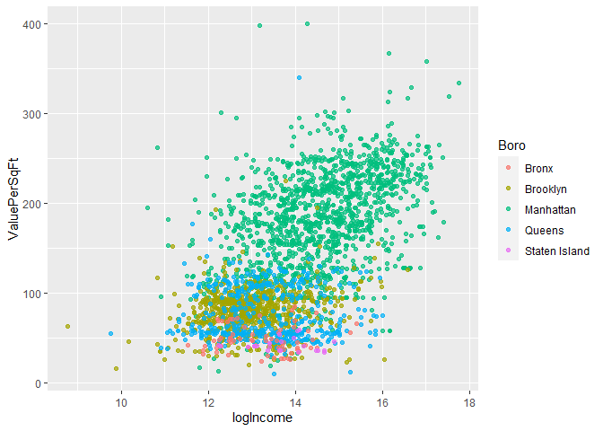<!-- --><!-- -->

It is difficult to see any trends here between ValuePerSqFt and log
features. But we can see again the importance of the Boro, in particular
with Manhattan.

Another useful analysis is the correlation matrix. We can plot it using
an heatmap, which also include dendrogram. It helps understanding
relation between features.

``` r
# Create a correlation matrix
cor_df <- cor(select_if(df, is.numeric))
heatmap(cor_df, scale="column", margins=c(5, 5))
```

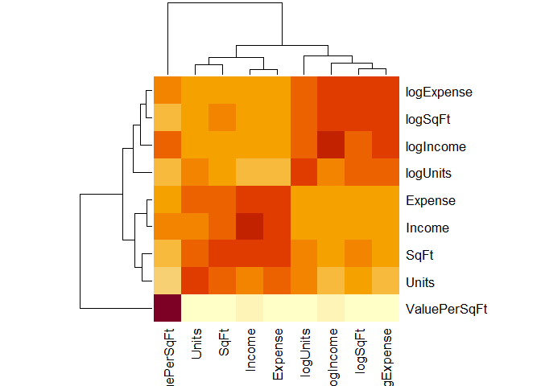<!-- -->

Some features are correlated, but there is no high correlation, so no
fear about multi-colinearity. We can move on to the modeling section.

## Modeling

We will define a linear model to predict the value per square foot with
other features but without log features in a first step.

``` r
# Fit the linear regression
model.1 <- lm(ValuePerSqFt ~ Boro + Units + SqFt + Expense + Income,
             data=df)

# Model informations
summary(model.1)
```

    ## 
    ## Call:
    ## lm(formula = ValuePerSqFt ~ Boro + Units + SqFt + Expense + Income, 
    ##     data = df)
    ## 
    ## Residuals:
    ##      Min       1Q   Median       3Q      Max 
    ## -201.149  -20.502    0.848   21.899  258.130 
    ## 
    ## Coefficients:
    ##                     Estimate Std. Error t value Pr(>|t|)    
    ## (Intercept)        6.336e+01  4.728e+00  13.402  < 2e-16 ***
    ## BoroBrooklyn       2.348e+01  4.872e+00   4.820 1.52e-06 ***
    ## BoroManhattan      1.058e+02  4.840e+00  21.850  < 2e-16 ***
    ## BoroQueens         2.500e+01  4.990e+00   5.010 5.79e-07 ***
    ## BoroStaten Island -1.406e+00  8.740e+00  -0.161    0.872    
    ## Units             -9.405e-03  2.175e-02  -0.432    0.665    
    ## SqFt              -2.985e-04  3.462e-05  -8.622  < 2e-16 ***
    ## Expense           -3.331e-05  3.219e-06 -10.348  < 2e-16 ***
    ## Income             2.057e-05  7.803e-07  26.364  < 2e-16 ***
    ## ---
    ## Signif. codes:  0 '***' 0.001 '**' 0.01 '*' 0.05 '.' 0.1 ' ' 1
    ## 
    ## Residual standard error: 37.71 on 2611 degrees of freedom
    ## Multiple R-squared:  0.698,  Adjusted R-squared:  0.6971 
    ## F-statistic: 754.4 on 8 and 2611 DF,  p-value: < 2.2e-16

Now our linear regression are fit. We can use the summary function to
print out information about the models.

We have a R-squared of 70%, it reveals that 70% of the variability
observed in the target variable (ValuePerSqFt) is explained by the
regression model. Which is not bad. We can note also that almost all the
predictors are significant, except the Units. The Staten Island is not
significant compare to the referential group which is the Bronx, as we
have seen in the plots above, we have few data, and they are very
similar for the two groups.

But now we can use the log features instead, to see if there is an
improvement.

``` r
# Fit the linear regression
model.2 <- lm(ValuePerSqFt ~ Boro + logUnits + logSqFt + logExpense
             + logIncome,
             data=df)

# Model informations
summary(model.2)
```

    ## 
    ## Call:
    ## lm(formula = ValuePerSqFt ~ Boro + logUnits + logSqFt + logExpense + 
    ##     logIncome, data = df)
    ## 
    ## Residuals:
    ##      Min       1Q   Median       3Q      Max 
    ## -148.095   -8.417   -2.361    8.731  223.469 
    ## 
    ## Coefficients:
    ##                    Estimate Std. Error t value Pr(>|t|)    
    ## (Intercept)       -365.9461     8.1170 -45.084  < 2e-16 ***
    ## BoroBrooklyn       -14.8079     2.6034  -5.688 1.43e-08 ***
    ## BoroManhattan      -14.7519     2.8975  -5.091 3.81e-07 ***
    ## BoroQueens         -17.8059     2.6571  -6.701 2.52e-11 ***
    ## BoroStaten Island   -2.6959     4.5713  -0.590   0.5554    
    ## logUnits            -1.7750     0.8984  -1.976   0.0483 *  
    ## logSqFt           -118.8565     2.2960 -51.766  < 2e-16 ***
    ## logExpense         -73.5380     2.3609 -31.148  < 2e-16 ***
    ## logIncome          196.5220     2.0586  95.463  < 2e-16 ***
    ## ---
    ## Signif. codes:  0 '***' 0.001 '**' 0.01 '*' 0.05 '.' 0.1 ' ' 1
    ## 
    ## Residual standard error: 19.72 on 2611 degrees of freedom
    ## Multiple R-squared:  0.9175, Adjusted R-squared:  0.9172 
    ## F-statistic:  3628 on 8 and 2611 DF,  p-value: < 2.2e-16

The result is much more better, we have a R-squared of 92%, it reveals
that 92% of the variability observed in the target variable
(ValuePerSqFt) is explained by the regression model. Which is very good

The coefficients represents the effect of the predictors on the response
(ValuePerSqFt) and the standard errors are the uncertainty in the
estimation of the coefficients.

We can use a visualisation plot to show the coefficient of the
regression model. In general, a good rule of thumb is that if the two
standard error confidence interval does not contain 0, it is
statistically significant.

``` r
# Visualize model coefficient
multiplot(model.1, model.2, sort="mag")
```

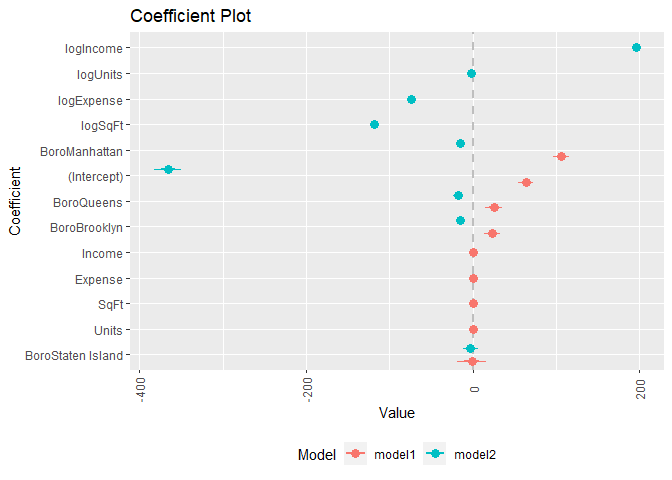<!-- -->

We can see that using the model.2 (with log features) is more
significant here. But one of the first-taught ways of assessing model
quality is analysis of the residuals, which is the difference between
the actual response and the fitted values. The basic idea is that if the
model is appropriately fitted to the data, the residuals should be
normally distributed as well.

To see that, we can plot residuals against fitted values:

``` r
# Check model performance with residuals against fitted values
ggplot(aes(x = .fitted, y = .resid), data = model.2) +
  geom_point(aes(color = factor(Boro)), alpha = 0.7) +
  geom_hline(yintercept = 0) +
  geom_smooth(se = TRUE) +
  labs(x = "Fitted values", y = "Residuals") +
  scale_color_discrete(name = "Boro")
```

    ## `geom_smooth()` using method = 'gam' and formula = 'y ~ s(x, bs = "cs")'

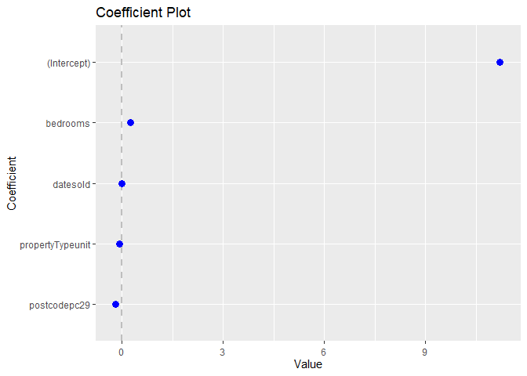<!-- -->

The graphic is at first glance disconcerting, because the pattern in the
residuals shows that they are not as randomly dispersed as desired. But
we can see that this is due to the structure that Boro gives the data.

Another way to check model quality is Q-Q plot. If the model is a good
fit, the standardized residuals should fall along a straight line when
plotted against the theoritical qauntiles of the normal distribution.

``` r
# Q-Q plot
ggplot(aes(sample = .stdresid), data = model.2) +
  stat_qq() +
  geom_abline() +
  labs(title = "Q-Q plot")
```

<!-- -->

Again it is roughly correct. May be we miss something, so we can check
the residuals against the leverage (and the Cook’s distance).

High leverage consist on looking only on the x-axis, so it is a point
which is far from the majority of the data, but it can be on all the
line of y-axis (this is why we also look at Cook’s distance). So high
leverage does imply outlier, but high leverage implies influence data
points. Note that leverage is between 0 and 1).

``` r
plot(model.2, which = 5)
```

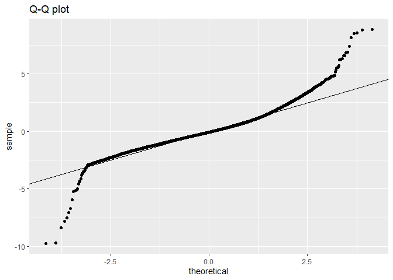<!-- -->

Here we can see that there is no high leverage, and none of the data
points can be considering as outliers regarding the Cook’s distance, (a
Cook’s distance above 0.5 can be consider as an outlier, and above 1
must be consider as an outlier).

So, may be we have some features that damage our model, we can use
stepwise selection based on AIC score to see if we can drop a feature to
improve our model.

``` r
# Stepwise selection based on AIC score
step(model.2, direction = "both")
```

    ## Start:  AIC=15631.64
    ## ValuePerSqFt ~ Boro + logUnits + logSqFt + logExpense + logIncome
    ## 
    ##              Df Sum of Sq     RSS   AIC
    ## <none>                    1014934 15632
    ## - logUnits    1      1517 1016451 15634
    ## - Boro        4     21534 1036468 15679
    ## - logExpense  1    377141 1392075 16458
    ## - logSqFt     1   1041657 2056591 17480
    ## - logIncome   1   3542444 4557378 19565

    ## 
    ## Call:
    ## lm(formula = ValuePerSqFt ~ Boro + logUnits + logSqFt + logExpense + 
    ##     logIncome, data = df)
    ## 
    ## Coefficients:
    ##       (Intercept)       BoroBrooklyn      BoroManhattan         BoroQueens  
    ##          -365.946            -14.808            -14.752            -17.806  
    ## BoroStaten Island           logUnits            logSqFt         logExpense  
    ##            -2.696             -1.775           -118.856            -73.538  
    ##         logIncome  
    ##           196.522

Nothing. Since the model quality check show us that we may miss
something, a last thing to check before concluding and use the model.2
is to check for interactions between features. Based on the graphical
analysis of the data, we can implement interaction terms between Boro
and LogIcome.

``` r
model.interact <- lm(ValuePerSqFt ~ Boro * logIncome + logExpense + logSqFt + logUnits,
             data=df)

summary(model.interact)
```

    ## 
    ## Call:
    ## lm(formula = ValuePerSqFt ~ Boro * logIncome + logExpense + logSqFt + 
    ##     logUnits, data = df)
    ## 
    ## Residuals:
    ##      Min       1Q   Median       3Q      Max 
    ## -146.692   -7.595   -2.002    7.782  226.478 
    ## 
    ## Coefficients:
    ##                              Estimate Std. Error t value Pr(>|t|)    
    ## (Intercept)                 -341.7939    37.6925  -9.068   <2e-16 ***
    ## BoroBrooklyn                  23.7679    38.4331   0.618   0.5364    
    ## BoroManhattan                -66.0017    37.4982  -1.760   0.0785 .  
    ## BoroQueens                     2.3585    38.8792   0.061   0.9516    
    ## BoroStaten Island             39.6033    85.4211   0.464   0.6430    
    ## logIncome                    192.1639     3.5079  54.780   <2e-16 ***
    ## logExpense                   -72.1611     2.3402 -30.835   <2e-16 ***
    ## logSqFt                     -117.2648     2.2814 -51.401   <2e-16 ***
    ## logUnits                      -1.9324     0.8877  -2.177   0.0296 *  
    ## BoroBrooklyn:logIncome        -2.9440     2.9015  -1.015   0.3104    
    ## BoroManhattan:logIncome        3.7943     2.8242   1.343   0.1792    
    ## BoroQueens:logIncome          -1.4527     2.9278  -0.496   0.6198    
    ## BoroStaten Island:logIncome   -3.0511     6.2808  -0.486   0.6272    
    ## ---
    ## Signif. codes:  0 '***' 0.001 '**' 0.01 '*' 0.05 '.' 0.1 ' ' 1
    ## 
    ## Residual standard error: 19.48 on 2607 degrees of freedom
    ## Multiple R-squared:  0.9196, Adjusted R-squared:  0.9192 
    ## F-statistic:  2485 on 12 and 2607 DF,  p-value: < 2.2e-16

To compare models with different number of parameters, we use the
adjusted R²; we can see that add an interaction terms does not improve
model performance.

We can create a graph that compare the three developed models using
adjusted R², AIC and BIC (note that BIC penalize more the fact that add
features than AIC).

``` r
# Construct a dataframe with the adj. R² for each model
result <- as.data.frame(rbind(
  summary(model.1)$adj.r.squared,
  summary(model.2)$adj.r.squared,
  summary(model.interact)$adj.r.squared
))

names(result) <- "Adj. R²"
result$Model <- c("Model.1", "Model.2", "Model.interaction")

# Add AIC and BIC scores
result$AIC <- AIC(model.1, model.2, model.interact)$AIC
result$BIC <- BIC(model.1, model.2, model.interact)$BIC

result.melt <- gather(result, 'Measure', 'Value', -Model)

ggplot(result.melt, aes(x=Model, y=Value)) +
  geom_line(aes(group=Measure, color=Measure)) +
  facet_wrap(~Measure, scales="free_y") +
  theme(axis.text.x=element_text(angle=45, vjust=.5)) +
  guides(color="none")
```

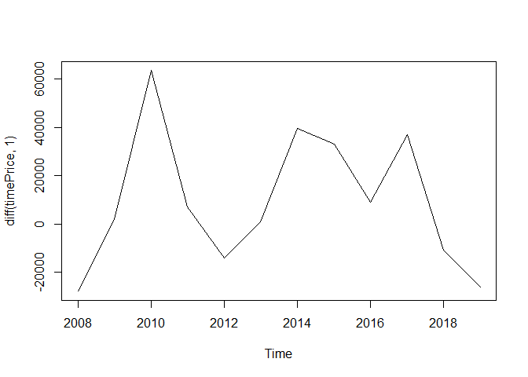<!-- -->

We can conclude that there is no need to include interaction terms here,
and we can use the model.2.

## Conclusion

This house price prediction project utilized machine learning, comparing
models with varied preprocessing approaches. The most effective model
emerged from combining data cleaning and log-transformed feature
engineering. Comprehensive analysis of model parameters and quality
metrics, visualized through plots, affirmed its superior performance.
This underscores the significance of preprocessing and feature
manipulation for accurate predictions. The identified optimal model
empowers real estate professionals with a robust tool for informed
decision-making. Overall, the project showcases the impact of thoughtful
data preparation in enhancing predictive capabilities.
