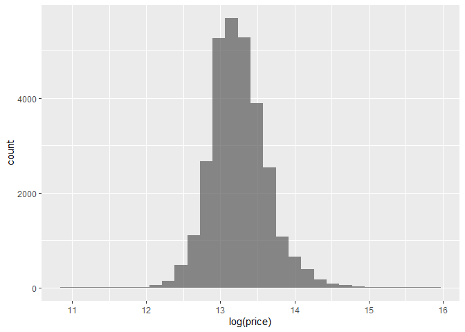
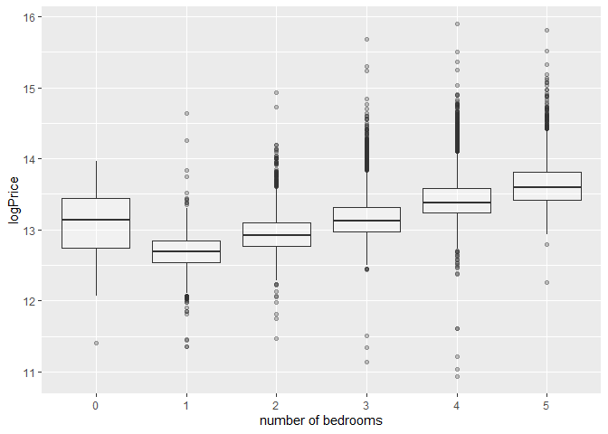
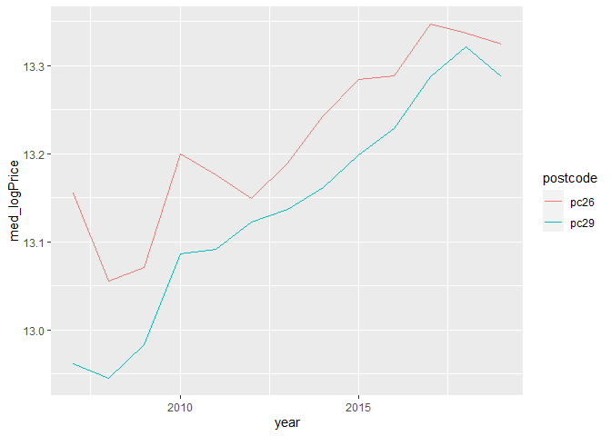
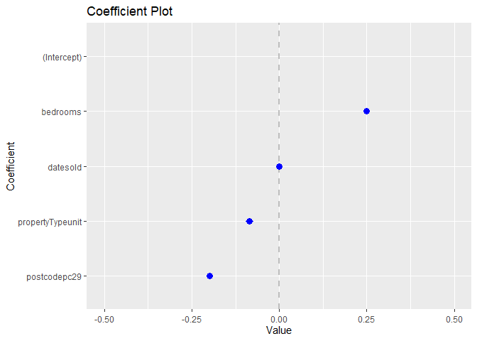
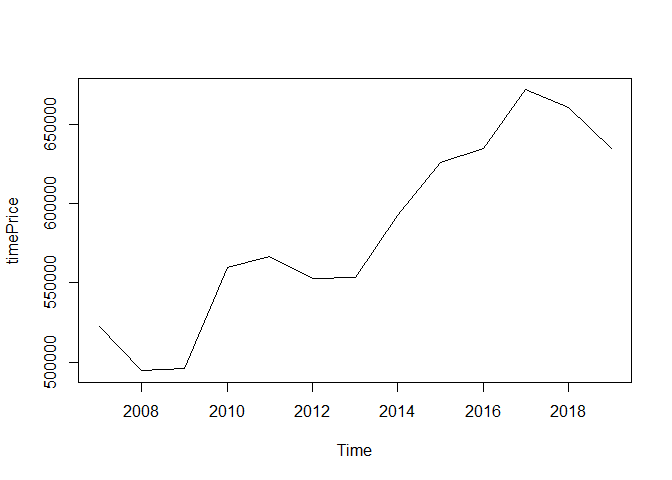
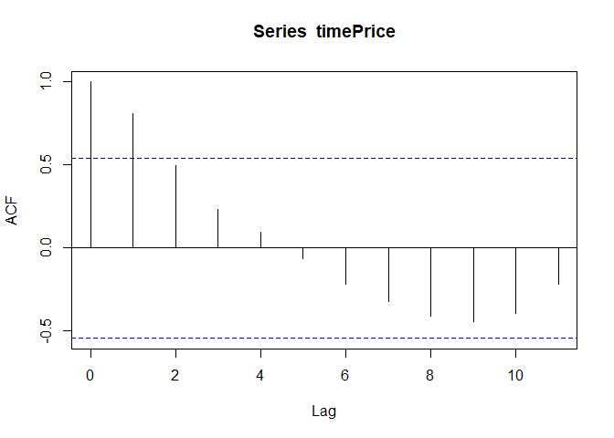
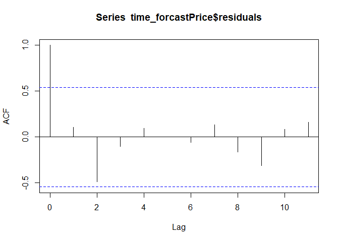
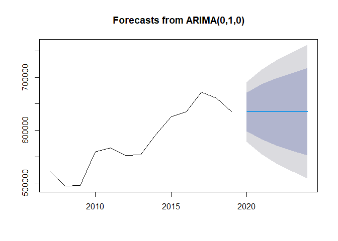

House price project
================
Adrien Riaux
01/08/2022

# House price project

``` r
#Import 
library(dplyr)
```

    ## Warning: le package 'dplyr' a été compilé avec la version R 4.1.3

    ## 
    ## Attachement du package : 'dplyr'

    ## Les objets suivants sont masqués depuis 'package:stats':
    ## 
    ##     filter, lag

    ## Les objets suivants sont masqués depuis 'package:base':
    ## 
    ##     intersect, setdiff, setequal, union

``` r
library(tidyr)
```

    ## Warning: le package 'tidyr' a été compilé avec la version R 4.1.2

``` r
library(ggplot2)
```

    ## Warning: le package 'ggplot2' a été compilé avec la version R 4.1.2

``` r
library(lubridate)
```

    ## Warning: le package 'lubridate' a été compilé avec la version R 4.1.2

    ## 
    ## Attachement du package : 'lubridate'

    ## Les objets suivants sont masqués depuis 'package:base':
    ## 
    ##     date, intersect, setdiff, union

``` r
library(coefplot)
```

    ## Warning: le package 'coefplot' a été compilé avec la version R 4.1.3

``` r
library(forecast)
```

    ## Warning: le package 'forecast' a été compilé avec la version R 4.1.3

    ## Registered S3 method overwritten by 'quantmod':
    ##   method            from
    ##   as.zoo.data.frame zoo

    ## Registered S3 methods overwritten by 'forecast':
    ##   method       from  
    ##   autoplot.acf useful
    ##   fortify.ts   useful

We have several columns : - datesold : date of the property sale -
postcode : postal code of the property - price : sale price of the
property - propertyType : unit or house - bedrooms : number of bedrooms
per property

``` r
#Read data
df = read.csv("house_price.csv", header = TRUE, sep = ",")
head(df)
```

    ##              datesold postcode  price propertyType bedrooms
    ## 1 2007-02-07 00:00:00     2607 525000        house        4
    ## 2 2007-02-27 00:00:00     2906 290000        house        3
    ## 3 2007-03-07 00:00:00     2905 328000        house        3
    ## 4 2007-03-09 00:00:00     2905 380000        house        4
    ## 5 2007-03-21 00:00:00     2906 310000        house        3
    ## 6 2007-04-04 00:00:00     2905 465000        house        4

We can observe that our dataframe contains date, but there store as
characters. Moreover, it seems that the propertyType and bedrooms
columns are categorical features. To verify that, we observe the number
of unique value for these features.

``` r
#Check unique value of categorical features
for (i in c("propertyType", "bedrooms")) {
  print(unique(df[,i]))
}
```

    ## [1] "house" "unit" 
    ## [1] 4 3 5 1 2 0

Well, we have only to possible values for properyType and 6 for
bedrooms. Use propertyType as factor would be interesting but we will
keep bedrooms as int, because there are an order in this features. Have
3 bedrooms is better than only 2 for example.

So we can now convert propertyType and datesold features into
appropriate types.

``` r
#Convert type
df[, "propertyType"] <- as.factor(df[, "propertyType"])
df[, "datesold"] <- as.Date(df[, "datesold"])

sapply(df, class)
```

    ##     datesold     postcode        price propertyType     bedrooms 
    ##       "Date"    "integer"    "integer"     "factor"    "integer"

``` r
#Data description
summary(df)
```

    ##     datesold             postcode        price         propertyType 
    ##  Min.   :2007-02-07   Min.   :2600   Min.   :  56500   house:24552  
    ##  1st Qu.:2013-02-05   1st Qu.:2607   1st Qu.: 440000   unit : 5028  
    ##  Median :2015-09-30   Median :2615   Median : 550000                
    ##  Mean   :2015-02-21   Mean   :2730   Mean   : 609736                
    ##  3rd Qu.:2017-07-26   3rd Qu.:2905   3rd Qu.: 705000                
    ##  Max.   :2019-07-27   Max.   :2914   Max.   :8000000                
    ##     bedrooms   
    ##  Min.   :0.00  
    ##  1st Qu.:3.00  
    ##  Median :3.00  
    ##  Mean   :3.25  
    ##  3rd Qu.:4.00  
    ##  Max.   :5.00

We have no null values in the dataframe. Moreover postcode is only 4
digits reference, we don’t expect that this data will be useful in this
form. We will probably transform it into a categorical class.

Price has outliers, we will deal with it later.

### Exploratory data analysis

``` r
#Plot histogram of price
ggplot(data = df, aes(x = price)) +
  geom_histogram(alpha = 0.7)
```

    ## `stat_bin()` using `bins = 30`. Pick better value with `binwidth`.

<!-- -->

``` r
#Plot histogram of price using log scale
ggplot(data = df, aes(x = log(price))) + 
  geom_histogram(alpha = 0.7) 
```

    ## `stat_bin()` using `bins = 30`. Pick better value with `binwidth`.

<!-- --> Price
has a log normal distribution, then it can be difficult for our machine
learning model to predict value. Using log on price give a normal
distribution. So we create a new column : logPrice = log(price).

``` r
#Create logPrice column
df$logPrice = log(df$price)
head(df)
```

    ##     datesold postcode  price propertyType bedrooms logPrice
    ## 1 2007-02-07     2607 525000        house        4 13.17115
    ## 2 2007-02-27     2906 290000        house        3 12.57764
    ## 3 2007-03-07     2905 328000        house        3 12.70077
    ## 4 2007-03-09     2905 380000        house        4 12.84793
    ## 5 2007-03-21     2906 310000        house        3 12.64433
    ## 6 2007-04-04     2905 465000        house        4 13.04979

``` r
#Plot density of postcode per propertyType
ggplot(data = df, aes(x = postcode)) + #Add histogram
  geom_histogram(aes(
    y = ..density.., 
    fill = propertyType, 
    color = propertyType
  ), 
  alpha = 0.3, position = "identity") + 
  geom_density(aes(color = propertyType), size = 0.7)
```

    ## `stat_bin()` using `bins = 30`. Pick better value with `binwidth`.

<!-- --> We have
two group of postcode. But neither match with a propertyType. It could
be interesting to create a categorical feature for the postcode and
check if they are a place where the price is higher. It can be
interpreted like neighbourhoods.

``` r
#Create a categorical feature
df <- df %>% mutate(postcode = case_when(postcode > 2800 ~ "pc29",
                                         TRUE ~ "pc26"))

#Convert type
df[, "postcode"] <- as.factor(df[, "postcode"])
```

Now we can visualize price per propertyType and postcode.

``` r
#Price boxplot
ggplot(data = df, aes(x = propertyType, y = logPrice)) + geom_boxplot(aes(color = postcode))
```

<!-- -->

It seems that property with postcode start with 26 are little more
expensive than the others, but it still have an overlap between the two
neighbourhoods.

Another interesting graphic is price against number of bedrooms.

``` r
#Price against bedrooms
ggplot(df, aes(x = factor(bedrooms), y = logPrice)) + 
  geom_boxplot(alpha = 0.3) +
  labs(x = "number of bedrooms")
```

<!-- --> Some
houses/units with 0 bedrooms. It seems strange, moreover if we look at
the boxplot, the price for these houses/units are particularly
expensive. So we check the number of values per bedrooms.

``` r
#Value counts for the bedrooms feature
table(df$bedrooms)
```

    ## 
    ##     0     1     2     3     4     5 
    ##    30  1627  3598 11933 10442  1950

They are only 30 houses/units with 0 bedrooms. We will simply drop them.

``` r
#Drop line with zero bedrooms
print(nrow(df))
```

    ## [1] 29580

``` r
df <- df %>% filter(bedrooms != 0)
print(nrow(df))
```

    ## [1] 29550

Very good, we have drop lines with zero bedrooms.

Another important graphic is the correlation heatmap. It shows the
correlation between features, i.e. we need to test price and bedrooms
relationship with each other.

``` r
#Create a correlation matrix
corr_df <- df %>% select(c("logPrice", "bedrooms")) %>% cor()
corr_df
```

    ##          logPrice bedrooms
    ## logPrice 1.000000 0.614465
    ## bedrooms 0.614465 1.000000

``` r
#Create month and year columns
df$year <- year(df$datesold)
df$month <- month(df$datesold, label = TRUE)
```

``` r
#Reshape data by year and month and calculate the price average
df_time <- df %>% group_by(year, month) %>% summarize(med_logPrice = median(logPrice))
```

    ## `summarise()` has grouped output by 'year'. You can override using the
    ## `.groups` argument.

``` r
#Plot price evolution per month
ggplot(df_time, aes(x = month, y = med_logPrice)) +
  geom_line(aes(color = factor(year), group = year)) +
  scale_color_discrete(name = "year")
```

<!-- -->

``` r
#Reshape data by year
df_time <- df %>% group_by(year, postcode) %>% summarize(med_logPrice = median(logPrice))
```

    ## `summarise()` has grouped output by 'year'. You can override using the
    ## `.groups` argument.

``` r
ggplot(df_time, aes(x = year, y = med_logPrice)) +
  geom_line(aes(color = postcode))
```

<!-- -->

### Modeling

We will define a linear model to predict the price with other features.

``` r
#Fit the linear regression
model <- lm(logPrice ~ datesold + bedrooms + postcode + propertyType,
             data = df)

#Model informations
summary(model)
```

    ## 
    ## Call:
    ## lm(formula = logPrice ~ datesold + bedrooms + postcode + propertyType, 
    ##     data = df)
    ## 
    ## Residuals:
    ##     Min      1Q  Median      3Q     Max 
    ## -2.5989 -0.1643 -0.0217  0.1341  2.3568 
    ## 
    ## Coefficients:
    ##                    Estimate Std. Error t value Pr(>|t|)    
    ## (Intercept)       1.121e+01  2.506e-02  447.36   <2e-16 ***
    ## datesold          7.999e-05  1.453e-06   55.03   <2e-16 ***
    ## bedrooms          2.491e-01  2.230e-03  111.68   <2e-16 ***
    ## postcodepc29     -1.984e-01  3.279e-03  -60.50   <2e-16 ***
    ## propertyTypeunit -8.517e-02  5.692e-03  -14.96   <2e-16 ***
    ## ---
    ## Signif. codes:  0 '***' 0.001 '**' 0.01 '*' 0.05 '.' 0.1 ' ' 1
    ## 
    ## Residual standard error: 0.2669 on 29545 degrees of freedom
    ## Multiple R-squared:  0.4932, Adjusted R-squared:  0.4931 
    ## F-statistic:  7188 on 4 and 29545 DF,  p-value: < 2.2e-16

Now our linear regression are fit. We can use the summary function to
print out information about the models.

We have a R-squared of 49%, it reveals that 49% of the variability
observed in the target variable (logPrice) is explained by the
regression model.

The coefficients represents the effect of the predictors on the response
(logPrice) and the standard errors are the uncertainty in the estimation
of the coefficients. We a visualisation plot to show the coefficient of
the regression model. In general, a good rule of thumb is that if the
two standard error confidence interval does not contain 0, it is
statistically significant.

``` r
#Visualize model coefficient
coefplot(model, sort = 'mag')
```

<!-- -->

``` r
#Visualize model coefficient with limited x axis scale
coefplot(model, sort = 'mag') + scale_x_continuous(limits = c(-0.5,0.5))
```

    ## Warning: Removed 1 rows containing missing values (geom_point).

<!-- -->

``` r
#Check model performance with residual against fitted values
ggplot(aes(x = .fitted, y = .resid), data = model) +
  geom_point(aes(color = factor(bedrooms)), alpha = 0.7) +
  geom_hline(yintercept = 0) +
  geom_smooth(se = T) +
  labs(x = "Fitted values", y = "Residuals") +
  scale_color_discrete(name = "bedrooms")
```

    ## `geom_smooth()` using method = 'gam' and formula 'y ~ s(x, bs = "cs")'

<!-- -->

``` r
#Q-Q plot
ggplot(aes(sample = .stdresid), data = model) + 
  stat_qq() + 
  geom_abline() +
  labs(title = "Q-Q plot")
```

<!-- -->

Now we are interesting in modelisation of time series.

``` r
#Define the new dataframe with the median log price per year
df_time <- df %>% group_by(year) %>% summarize(meanPrice = mean(price))

#We convert it to a time series
timePrice <- ts(df_time$meanPrice, start = min(df_time$year), end = max(df_time$year))

#Plot the time series
plot(timePrice)
```

<!-- -->

``` r
#Show the autocovariance function (ACF)
acf(timePrice)
```

<!-- -->

``` r
#Determining the optimal number of diffs
ndiffs(x = timePrice)
```

    ## [1] 1

``` r
plot(diff(timePrice, 1))
```

<!-- -->

``` r
time_forcastPrice <- auto.arima(x = timePrice)
time_forcastPrice
```

    ## Series:  
    ## ARIMA(0,1,0) 
    ## 
    ## sigma^2 = 830345258:  log likelihood = -140.25
    ## AIC=282.5   AICc=282.9   BIC=282.99

``` r
acf(time_forcastPrice$residuals)
```

<!-- -->

``` r
predict(time_forcastPrice, n.ahead = 5, se.fit = T)
```

    ## $pred
    ## Time Series:
    ## Start = 2020 
    ## End = 2024 
    ## Frequency = 1 
    ## [1] 634830.9 634830.9 634830.9 634830.9 634830.9
    ## 
    ## $se
    ## Time Series:
    ## Start = 2020 
    ## End = 2024 
    ## Frequency = 1 
    ## [1] 28815.71 40751.57 49910.28 57631.42 64433.89

``` r
plot(forecast(object = time_forcastPrice, h = 5))
```

<!-- -->
